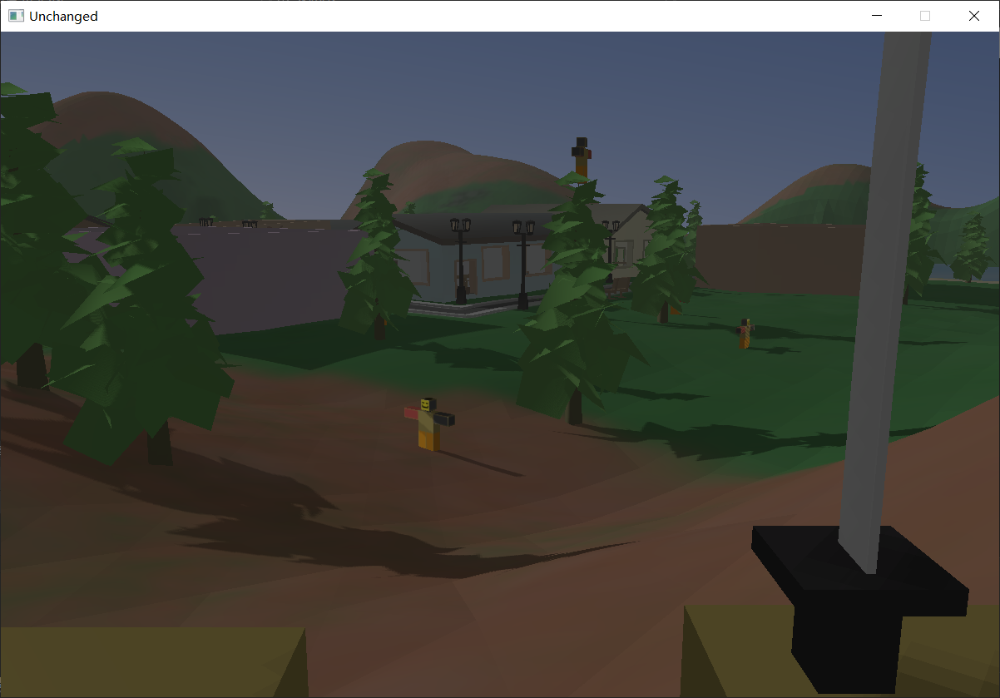

# Unchanged
一个使用opengl开发的简约风格小游戏，原项目[地址](https://github.com/230Twister/Unchanged)
，主要学习参考[LearnOpenGL](https://learnopengl.com/Introduction)

## 使用技术
+ 模型导入
+ 多光源冯氏光照
+ 动态水面
+ 阴影贴图
+ 动态天空与体积云
+ 简单物理引擎应用

## 安装方法
使用vcpkg安装第三方库

包括：
+ glad
+ glfw3
+ glm
+ assimp
+ stb
+ bullet3

模型下载：[地址](https://wwe.lanzouw.com/ifJ2Zxtnf7c)

最后使用cmake进行构建

## 说明文档
+ [级联阴影贴图CSM](https://oscarsalon.top/2023/01/cascadedshadowmaps/)
+ 动态天空与体积云

## 运行图片

